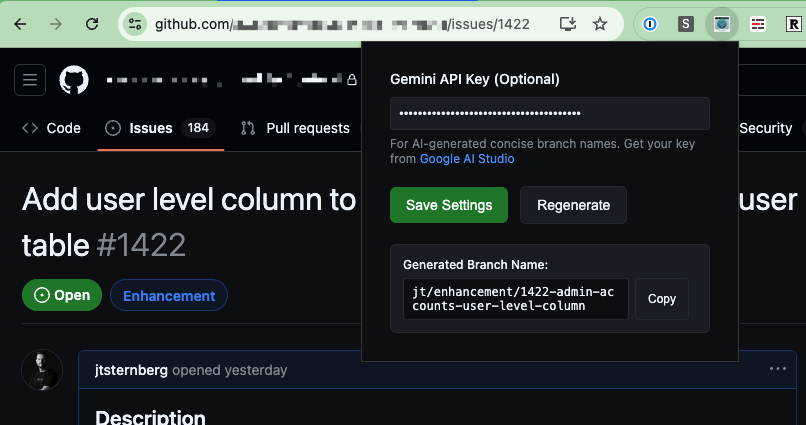

# Git Branch Name Generator Extension

A Chrome extension that generates concise Git branch names from GitHub issues and pull requests using AI. The extension creates branch names in the format `<type>/<issue-number>-<ai-generated-summary>` and copies them directly to your clipboard with a single click.

The original extension was created with the help of ChatGPT (specifically ChatGPT 4o using the MacOs version of ChatGPT). Checkout [ChatGPT-Prompt.md](ChatGPT-Prompt.md) which documents the prompts used to generate the extension, as a learning resource for developers.

The AI features and UI were all built later by [Claude Code](https://claude.ai/code).



## Features

- **AI-Powered Branch Names**: Uses Google's Gemini 1.5 Flash API to generate concise, meaningful branch names
- **Smart Fallback**: Falls back to title-based generation if AI is unavailable or no API key is configured
- **Auto-Generation & Copy**: Instantly generates branch names when you click the extension icon, saving to your clipboard - no additional clicks needed
- **Multi-Page Support**: Works on both GitHub Issues and Pull Request pages with robust DOM selector fallbacks
- **Format**: `<type>/<issue-number>-<ai-summary>` (e.g., `feature/123-add-user-authentication`)

## Installation

### Option 1: Download Pre-built Extension (Recommended)
1. Go to the [Releases page](https://github.com/jtsternberg/github-branch-generator/releases)
2. Download the latest `github-branch-generator-v*.zip` file
3. Extract the zip file to a folder on your computer
4. Open Chrome and navigate to `chrome://extensions/`
5. Enable "Developer mode" by toggling the switch in the top right corner
6. Click "Load unpacked" and select the extracted folder

### Option 2: Build from Source
1. Clone or download this repository to your local machine
2. Install dependencies and build the extension:
   ```bash
   npm install
   npm run build
   ```
3. Open Chrome and navigate to `chrome://extensions/`
4. Enable "Developer mode" by toggling the switch in the top right corner
5. Click "Load unpacked" and select the repository directory

## Setup & Usage

### First Time Setup
1. Click the extension icon on any GitHub issue or pull request page
2. The popup will open with a settings section
3. (Optional) Add your Gemini API key for AI-powered branch names:
   - Get a free API key from [Google AI Studio](https://aistudio.google.com/app/apikey)
   - Paste it in the "Gemini API Key" field and click "Save Settings"

### Daily Usage
1. Navigate to any GitHub issue or pull request page
2. Click the extension icon - that's it!
3. The branch name is automatically generated and copied to your clipboard
4. Use the "Regenerate" button if you want a different suggestion

## How It Works

The extension uses Google's Gemini 1.5 Flash API to analyze GitHub issue/PR titles and generate concise, meaningful branch names. When no API key is provided, it falls back to creating branch names from the original title.

## Development

### Build Commands
```bash
npm run build    # Build for production
npm run dev      # Build with file watching
npm run clean    # Clean dist directory
```

### Making Changes
1. Edit files in the `src/` directory
2. Run `npm run build` to rebuild
3. Reload the extension in `chrome://extensions/`

### Architecture Notes
- Content script is bundled into a single IIFE file for reliable multi-tab support
- Popup uses Chrome storage API for cross-session settings persistence
- Fallback DOM selectors ensure compatibility with GitHub UI changes

## License

This project is licensed under the [MIT License](https://opensource.org/licenses/MIT).